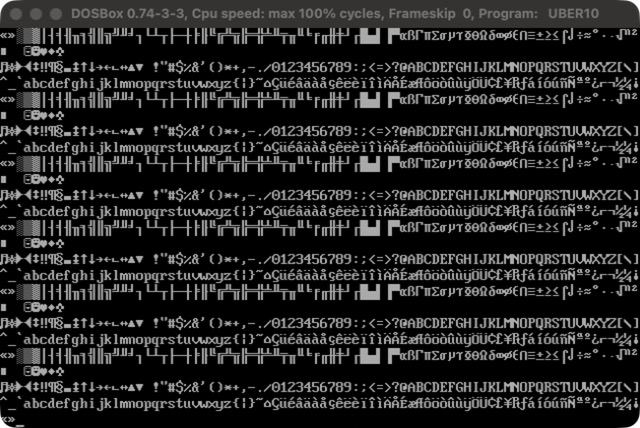

# UBER10

**A 10-byte DOS demo: the 256 CP437 glyphs, scrolling at a readable pace, with sound.**

[](https://github.com/djayuffe/uber10-dos-demo/actions/workflows/ci.yml)



Ten bytes. No setup, no assets, no libraries: it prints the 256 character codes in order, forever, eight per timer tick, so they scroll past at about two lines a second. Smileys, card suits, punctuation, digits, letters, box drawing, with CR/LF, backspace and BEL (07h, which beeps) doing their usual things.

| | |
|---|---|
| Size | **10 bytes** (class 16; a build gate stops it growing back) |
| CPU | any (8086 and up) |
| Video | 80x25 text (the DOS default) |
| Audio | the PC speaker beeps on BEL |

## Run it

Download `UBER10.COM` from the [latest release](../../releases/latest) and run it in DOSBox
(`mount c .`, `c:`, `UBER10.COM`), or build it:

```sh
./build.sh        # NASM build + size gates
./run-dosbox.sh   # run it in DOSBox
```

Needs [NASM](https://www.nasm.us/) and [DOSBox](https://www.dosbox.com/)
(macOS: `brew install nasm` and `brew install --cask dosbox`).

**UBER10 never exits** (no bytes to spare for the keyboard): close DOSBox, or press Ctrl+F9 in it.

## How it works

```
.m: hlt           ; F4        sleep until the next timer tick
.l: int 29h       ; CD 29     DOS "fast console output": print AL
    inc ax        ; 40        next code
    test al,7     ; A8 07     8 codes per tick
    jnz .l        ; 75 F9
    jmp short .m  ; EB F4
```

DOS starts a `.COM` with `AX = 0` and the screen already in 80x25 text mode, so there is nothing to set up:
`INT 29h` prints `AL` and `AX` just counts.

**Why it has a `HLT`.** The first version was the bare loop (`int 29h` / `inc ax` / `jmp`, 5 bytes). It was correct, but it prints
as fast as the machine allows, so on a modern emulator it is an unreadable blur rather than a scroll. `HLT` sleeps until the
next timer interrupt (18.2 Hz); printing 8 codes per tick gives about 145 characters a second, roughly two lines a second,
which scrolls and can be read. The cost is 5 more bytes (`hlt`, `test al,7`, `jnz`, and a longer `jmp`). It relies on the
DOS entry convention `AX = 0`.

## Testing

`tests/run_tests.sh` runs the real binary in an emulated 16-bit CPU (Unicorn), entered the way DOS enters
a `.COM`. It checks that the binary fits its size gates, sets no video mode, waits for a timer tick before every burst and prints exactly 8 characters per tick (so about 145 a second at 18.2 Hz), starts at code 0 and counts up by one wrapping at 256 (all 256 distinct codes, including BEL), and touches no memory outside its segment. CI runs it on every push; a `vX.Y.Z` tag publishes a release.

## Related

Part of a small family of DOS size-coding demos, each in its own repository:
[uber10-dos-demo](https://github.com/djayuffe/uber10-dos-demo) (10 bytes),
[uber128-dos-demo](https://github.com/djayuffe/uber128-dos-demo) (77 bytes),
[uber256-dos-demo](https://github.com/djayuffe/uber256-dos-demo) (171 bytes),
[uber256-dos-intro](https://github.com/djayuffe/uber256-dos-intro) (131 bytes), and the big one,
[uber40k-dos-demo](https://github.com/djayuffe/uber40k-dos-demo) (a 20-scene show with a 3D engine and
Sound Blaster music). The index is [uber-tiny-demos](https://github.com/djayuffe/uber-tiny-demos).

## License

MIT
